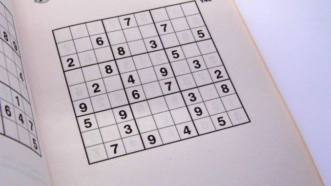
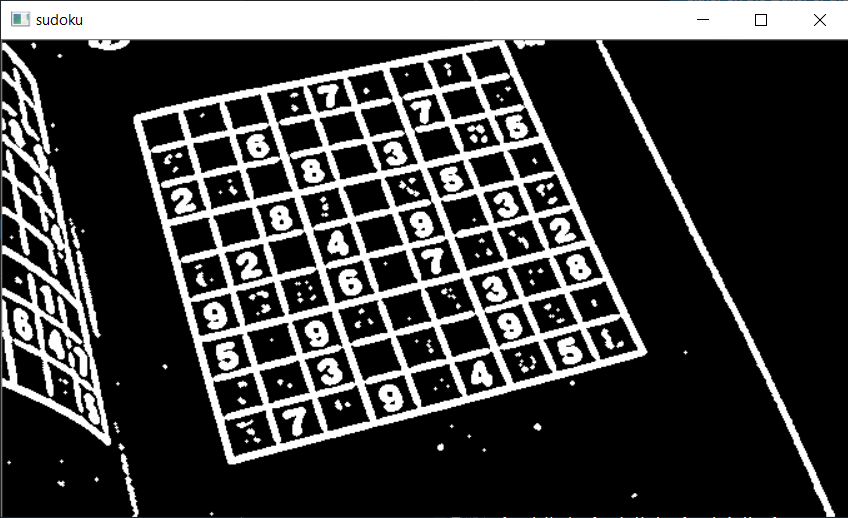
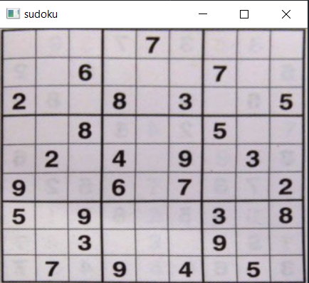
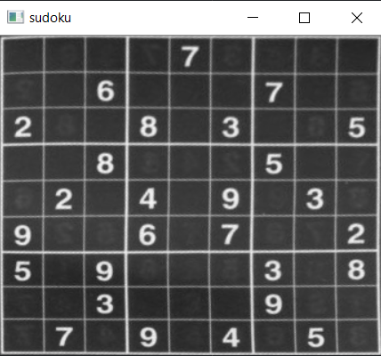
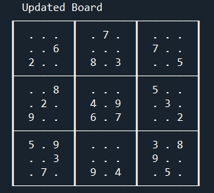
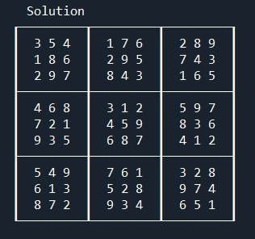

# Sudoku-Solver-OpenCV
We will be solving some Sudoku puzzles using AI, Python and OpenCV. It uses a collection of image processing techniques and Convolutional Neural Networks to detect the digits and then using backtraking to solve the sudoku.

## Prerequisites
* Python 3.5
* OpenCV

## How to use
``python3 main.py``
#### Note : The image path can be changed in pre_process.py

## Procedure
1. Preprocessing the image(Gaussian Blur, Thresholing, Dilating).
2. Finding the largest countour(Sudoku block) and getting it's coordinates.
3. Cropping the image.
4. Wrapping the perspective.
5. Extracting each cell by slicing the image.
6. Positioning the number in the image.
7. Using a pre-trained MNIST Digit Recognition model to predict the digits.
8. Solving the sudoku using backtracking  and recursion.

## Detailed Steps
#### 1. Input Image

#### 2. Preprocessing The Image

#### 3. Cropping

#### 4. Cropped and Processed Image

#### 5. Extracted Grid

#### 6. Solved Sudoku

## Resources
* [Deep Learning Introduction](https://www.forbes.com/sites/bernardmarr/2018/10/01/what-is-deep-learning-ai-a-simple-guide-with-8-practical-examples/?sh=3c88e45c8d4b)
* [Convolutional Neural Networks](https://towardsdatascience.com/a-comprehensive-guide-to-convolutional-neural-networks-the-eli5-way-3bd2b1164a53)
* [Sudoku Solver using AI](https://aakashjhawar.medium.com/sudoku-solver-using-opencv-and-dl-part-1-490f08701179)
